<!--
This page has four visible editions: day/night × desktop/mobile.
GitHub picks one. The copy changes with the light.

The fifth edition is this source.
You found it.
-->

  <picture>
    <source media="(max-width: 640px) and (prefers-color-scheme: dark)" srcset="assets/hero-dark-mobile.svg" />
    <source media="(max-width: 640px) and (prefers-color-scheme: light)" srcset="assets/hero-light-mobile.svg" />
    <source media="(prefers-color-scheme: dark)" srcset="assets/hero-dark.svg" />
    <source media="(prefers-color-scheme: light)" srcset="assets/hero-light.svg" />
    
  </picture>

<a href="#now">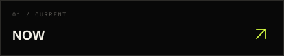</a><!--
--><a href="#why">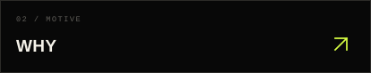</a>

<a href="#offscreen">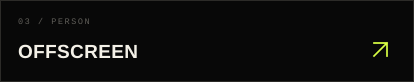</a><!--
--><a href="#not-sure">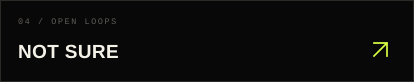</a>

<a href="https://github.com/GodlyDonuts?tab=repositories&sort=updated">
  <picture>
    <source media="(max-width: 640px)" srcset="assets/now-mobile.svg" />
    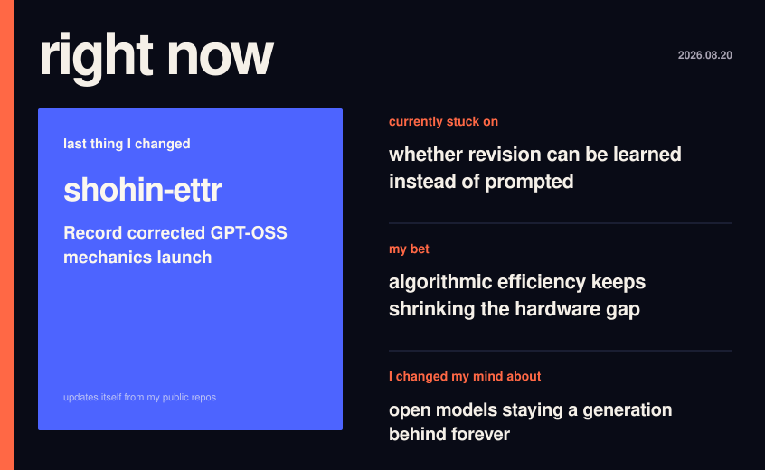
  </picture>
</a>

<picture>
  <source media="(max-width: 640px)" srcset="assets/summary-why-mobile.svg" />
  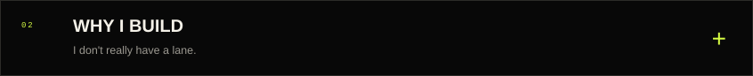
</picture>

<picture>
  <source media="(max-width: 640px)" srcset="assets/why-mobile.svg" />
  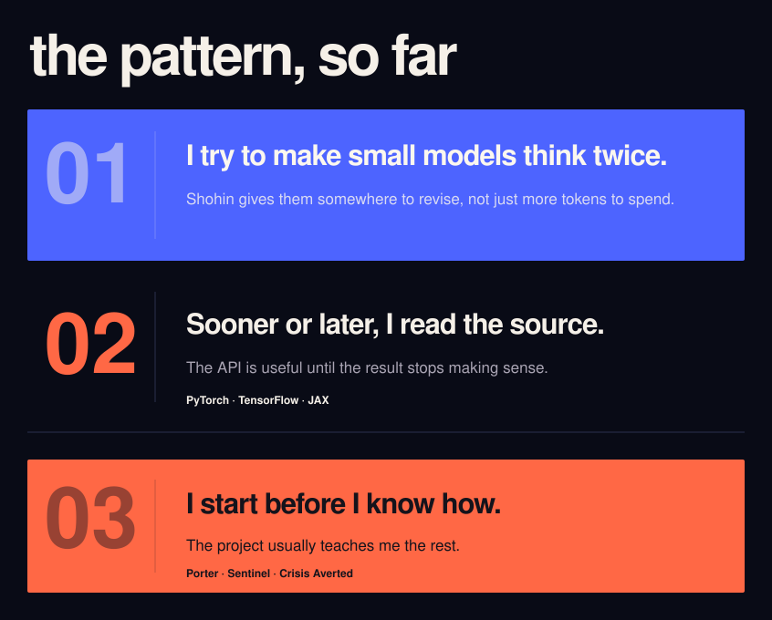
</picture>

<picture>
  <source media="(max-width: 640px)" srcset="assets/summary-offscreen-mobile.svg" />
  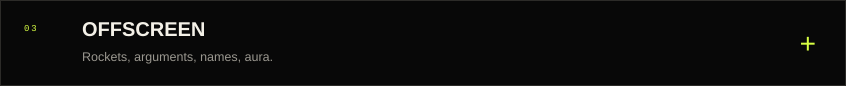
</picture>

<picture>
  <source media="(max-width: 640px)" srcset="assets/offscreen-mobile.svg" />
  
</picture>

<picture>
  <source media="(max-width: 640px)" srcset="assets/summary-uncertain-mobile.svg" />
  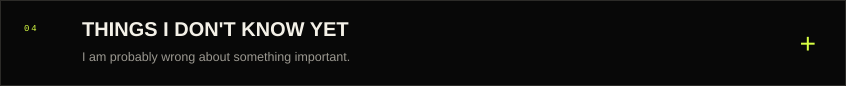
</picture>

<picture>
  <source media="(max-width: 640px)" srcset="assets/uncertain-mobile.svg" />
  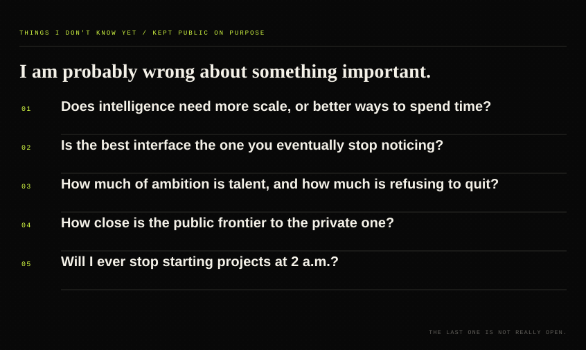
</picture>

<a href="mailto:csramineni@gmail.com">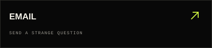</a><!--
--><a href="https://saicharanramineni.com">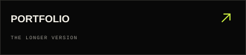</a>

<!--
--><a href="https://github.com/GodlyDonuts/Godlydonuts/issues/new?template=argument.yml">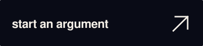</a>

<picture>
  <source media="(max-width: 640px)" srcset="assets/footer-mobile.svg" />
  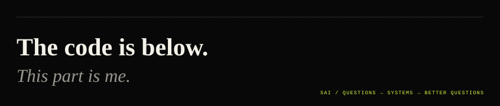
</picture>
