<!--
  ██ SETUP CHECKLIST — delete this comment once done ██
  1. This file replaces README.md in your profile repo: GodlyDonuts/Godlydonuts
  2. Commit header.svg to that same repo at  assets/header.svg  (path must match the  below)
  3. Fill in the two placeholders in the link row: YOUR-LINKEDIN and YOUR-EMAIL
  4. Optional: add the organizer / participant count to "The AI Championship" row if you have it —
     I couldn't verify those details, so I left the claim exactly as you stated it.
  5. Optional: if you want Shohin quiet until release, delete the "Now" section — everything else stands alone
  6. Pin these repos (Profile → Customize your pins): psi, sai, project-sentinel, Hacklytics-GoldenByte, vectorized-2048
-->

  <a href="https://saicharanramineni.com"><b>portfolio</b></a> ·
  <a href="https://www.linkedin.com/in/YOUR-LINKEDIN"><b>linkedin</b></a> ·
  <a href="mailto:YOUR-EMAIL"><b>email</b></a>

CS @ UCF (Burnett Honors College), undergrad research fine-tuning LLMs. I like the layer *under* the model — training stacks, GPU kernels, tokenizers, data pipelines — and I'd rather write these systems than read about them.

`C++` `CUDA` `Metal` `Python` `PyTorch` `JAX` `TypeScript`

### Now

Pretraining **Shohin** — a 135M-parameter language model built from scratch (custom tokenizer → custom data pipeline → 8×H100 training run), targeting state-of-the-art reasoning at the ≤150M scale. Release and writeup soon.

Also on the bench: **[gods-eye](https://github.com/GodlyDonuts/gods-eye)** — real-time monocular 3D reconstruction in Rust: one RGB camera in, a live adaptive-LOD triangle mesh out. Design stage.

### Selected work

**[psi](https://github.com/GodlyDonuts/psi)** — a small language model *and* the training stack it runs on, written from scratch in C++: own reverse-mode autograd (gradient-checked to ~1e-12), own Metal **and** CUDA kernels, zero ML frameworks anywhere in the stack.
- the 354K-param model matches the original **TinyStories-1M** on grammar / coherence / consistency / plot — at a third of the size
- hand-written Metal matmul: **883 GFLOP/s** at 2048³ on an M1 — 34% of peak, 6× the naive kernel, bit-exact against the CPU path
- ternary-weight matmul ({−1, 0, +1}): **16× smaller than fp32**, running at full fp32-matmul speed

**[sai](https://github.com/GodlyDonuts/sai)** — voice-native agentic OS co-pilot built on Amazon Nova: it hears a command, *sees* the screen (pure vision — no DOM, no selectors), and acts through a **Plan → Act → Verify** agent loop. "Hey Sai, answer this LeetCode problem" → reads it off the display, writes the solution in the editor, clicks Submit. 🏆 **Best Agentic AI @ Amazon Nova AI Hackathon** (13,000+ participants).

**[Project Sentinel](https://github.com/GodlyDonuts/project-sentinel)** — real-time voice anti-fraud guardian: streams live call audio over full-duplex WebSockets, transcribes with Deepgram, runs sub-second threat analysis on Cerebras (Llama 3.3-70B), and alerts mid-call — before the scam lands. 🏆 **Winner @ The AI Championship**.

**[Crisis Topography](https://github.com/GodlyDonuts/Hacklytics-GoldenByte)** — voice-commanded 3D geospatial crisis-intelligence platform: agentic orchestration over Databricks analytics and a self-hosted Actian vector store (18k+ embeddings, sub-100ms retrieval). 🥉 **3rd overall @ Hacklytics 2026** (Georgia Tech, 1,200+ builders).

**[vectorized-2048](https://github.com/GodlyDonuts/vectorized-2048)** — an RL environment rewritten as stateless, branchless matrix ops in JAX: **4,096 games simulated in parallel**, 200K+ training steps/sec on an M1 Air (2M+ inference), simulation and DQN training end-to-end on-GPU with zero host transfer.

### Open source

Merged PRs in **TensorFlow** core — [a segfault guard in `TensorListSetItem`](https://github.com/tensorflow/tensorflow/pull/121708) and [a float32 `erfinv` precision fix near ±1](https://github.com/tensorflow/tensorflow/pull/121644) — plus [Unsloth](https://github.com/unslothai/unsloth/pulls?q=is%3Apr+author%3AGodlyDonuts+is%3Amerged), [LiteLLM](https://github.com/BerriAI/litellm/pulls?q=is%3Apr+author%3AGodlyDonuts+is%3Amerged), [torchtitan](https://github.com/pytorch/torchtitan/pulls?q=is%3Apr+author%3AGodlyDonuts+is%3Amerged), and [wit-bindgen](https://github.com/bytecodealliance/wit-bindgen/pulls?q=is%3Apr+author%3AGodlyDonuts+is%3Amerged).

**[→ every merged PR, live from GitHub search](https://github.com/search?q=is%3Apr+is%3Amerged+author%3AGodlyDonuts&type=pullrequests)** — no curation, just the query.

### Wins

| | |
|---|---|
| **Amazon Nova AI Hackathon** | 🏆 Best Agentic AI · 13,000+ participants · [sai](https://github.com/GodlyDonuts/sai) |
| **The AI Championship** | 🏆 Winner · [Project Sentinel](https://github.com/GodlyDonuts/project-sentinel) |
| **Hacklytics 2026** (Georgia Tech) | 🥉 3rd overall · 1,200+ participants · [Crisis Topography](https://github.com/GodlyDonuts/Hacklytics-GoldenByte) |
| **NVIDIA Nemotron Challenge** (Kaggle) | z3-based cipher solvers + templated search for bit-manipulation puzzles |

### Stats

  <picture>
    <source media="(prefers-color-scheme: dark)" srcset="https://github-readme-stats.vercel.app/api?username=GodlyDonuts&show_icons=true&hide_border=true&theme=github_dark&bg_color=00000000">
    
  </picture>
  <picture>
    <source media="(prefers-color-scheme: dark)" srcset="https://github-readme-stats.vercel.app/api/top-langs/?username=GodlyDonuts&layout=compact&hide_border=true&theme=github_dark&bg_color=00000000">
    
  </picture>

  <b>Open to ML-infra / systems internships.</b> 
  Everything above links to a receipt — claims are cheap, merged PRs aren't.

