  

  <a href="https://saicharanramineni.com"><b>portfolio</b></a> ·
  <a href="https://www.linkedin.com/in/saicharan-ramineni/"><b>linkedin</b></a> ·
  <a href="mailto:csramineni@gmail.com"><b>email</b></a>

this is not a résumé. the repositories are the evidence; this page is the motive.

<!--
You opened the source instead of trusting the rendering.
Good instinct. We would probably get along.
-->

I’m **Sai**. I have a bad habit of asking questions that turn into months of work.

I do not like choosing an identity from a dropdown. Researcher, systems engineer, product builder—those are layers I pass through, not boxes I stay in. The stable thing is the kind of problem I am willing to chase: ambitious enough to be uncertain, concrete enough to be tested, and strange enough that I cannot leave it alone.

<b>01 / THE QUESTION ENGINE</b> — what pulls me in

 

Can a model learn when to reconsider? Can an interface disappear? Can one ordinary camera turn a room into geometry? What changes when we stop treating today’s abstraction as a law of nature?

I rarely know how to build the answer when I begin. Good. If I already knew, it would be execution rather than discovery. I am most alive in the stretch between *this should exist* and *I finally understand why it works*.

<b>02 / THE OPERATING SYSTEM</b> — how I work

 

I do not shrink an idea until it fits what I already know. I expand what I know until it fits the idea.

I follow problems through whatever layer they reach. If the abstraction hides something important, I go lower. If the result looks beautiful, I try harder to break it. If the system works but feels dead, it is not finished. Measurement, taste, and real-world contact are all parts of engineering—not separate phases.

<b>03 / THE CONTRADICTION</b> — ambition without self-deception

 

I am ambitious enough to attempt absurd things and skeptical enough to distrust my first result. I can obsess over a two-pixel visual detail, then delete weeks of work because one control failed. I am impatient with timid goals, patient with difficult work, and intensely competitive with versions of myself that do not exist yet.

The goal is not to look fearless. It is to become capable enough that fear stops deciding the size of the problem.

<b>04 / OFFSCREEN</b> — the person outside the terminal

 

I read too much about spaceflight and the AI race, lift, turn forecasts into debates, care irrationally about names, and judge software partly by whether it has aura. I will happily spend an hour arguing about whether a rocket, model release, or company strategy changes the balance of power.

I like people with strong opinions, evidence, and enough curiosity to change both.

<b>05 / THE HORIZON</b> — what I am moving toward

 

I want to spend my life close to the frontier of intelligence and autonomous systems, with people who move fast enough that “impossible” becomes an engineering schedule.

Not adjacent to the frontier. Helping move it.

 

  <a href="https://github.com/GodlyDonuts/Godlydonuts/issues/new?template=transmission.yml"><b>leave a transmission</b></a>
  &nbsp;·&nbsp;
  <a href="https://github.com/GodlyDonuts?tab=repositories"><b>follow the trail</b></a>

questions → systems → evidence → better questions

