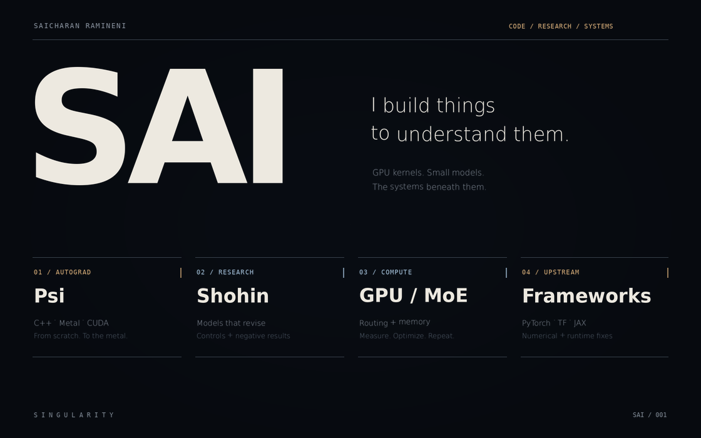

<!-- Generated by scripts/build_profile_art.py. Film source: scripts/build_singularity.py. -->

  <picture>
    <source media="(prefers-reduced-motion: reduce) and (max-width: 760px)" srcset="assets/singularity-mobile-poster.png" />
    <source media="(prefers-reduced-motion: reduce)" srcset="assets/singularity-poster.png" />
    <source media="(max-width: 760px)" type="image/webp" srcset="assets/singularity-mobile.webp" />
    <source type="image/webp" srcset="assets/singularity.webp" />
    
  </picture>

<strong>source code survived.</strong>

  <a href="https://github.com/GodlyDonuts/psi">Psi</a> ·
  <a href="https://github.com/GodlyDonuts/shohin-ettr">Shohin</a> ·
  <a href="https://github.com/GodlyDonuts/sai">Sai</a> ·
  <a href="https://saicharanramineni.com/projects">all projects</a> ·
  <a href="https://saicharanramineni.com/open-source">upstream</a>

<strong>Reconstruct the profile</strong>

I build things to understand them. GPU kernels, small models, and the systems beneath them.

- [Psi](https://github.com/GodlyDonuts/psi) — custom autograd and a language-model training stack, including Metal and CUDA.
- [Shohin](https://github.com/GodlyDonuts/shohin-ettr) — experiments on models revising their own drafts, including controls and negative results.
- [Sai](https://github.com/GodlyDonuts/sai) — a voice-driven Mac agent with action verification.
- [PyTorch](https://github.com/pytorch/pytorch/commit/42a70784390a343ebd90e9e84b1bf5a5df4901f3) — global scratch support in the static Triton launcher.
- [TensorFlow](https://github.com/tensorflow/tensorflow/pull/125171) — SELU gradient regression coverage.
- [Full open-source work](https://saicharanramineni.com/open-source) and [project index](https://saicharanramineni.com/projects).

  <a href="https://saicharanramineni.com/">portfolio</a> ·
  <a href="mailto:csramineni@gmail.com">email</a> ·
  <a href="https://www.linkedin.com/in/saicharan-ramineni/">LinkedIn</a>

